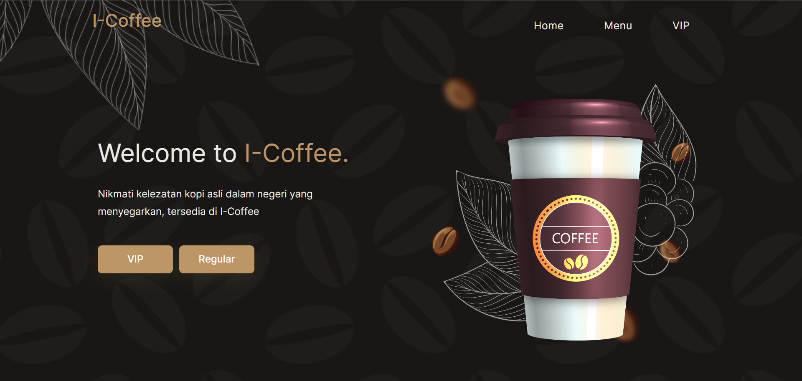
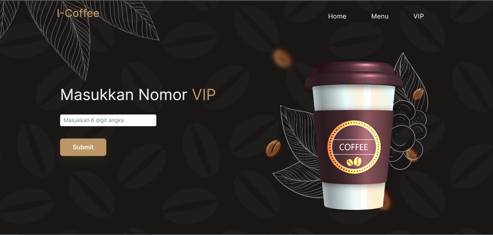
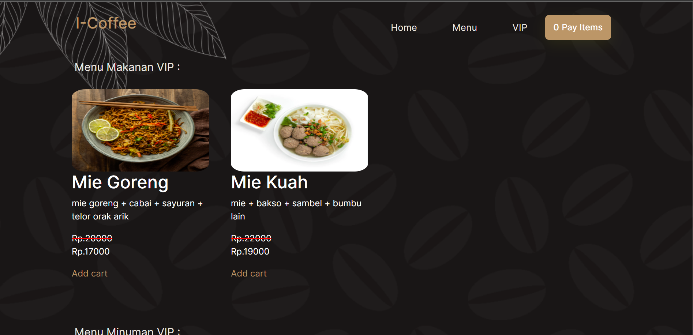
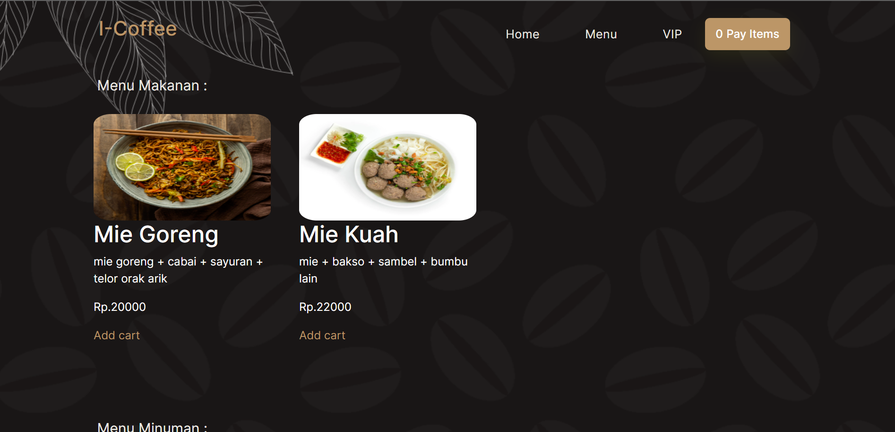
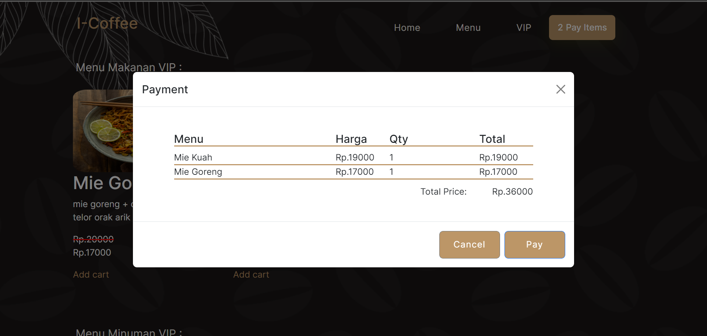

# TuBes-Chapter2-Kelompok3

## Latar Belakang
Cafe Internet I-Coffee ingin meningkatkan pelayanan untuk pelanggan reguler
dan pelanggan setianya, jadi ketika pelanggan tersebut ingin memesan, dia
bisa memilih bahwa dia pelanggan reguler atau VIP, jika dia pelanggan VIP
dia akan memasukkan nomor pelanggan terlebih dahulu sedangkan
pelanggan reguler bisa langsung memilih menunya, untuk harga pelanggan
VIP setiap makanan akan dikurangi sebesar 15% dan untuk minuman
dikurangi sebesar 10%. Buat aplikasi pemesanan ini dengan minimal ada 2
jenis makanan dan 2 jenis minuman yang ada di menu dengan harga yang
berbeda beda, serta bisa melakukan perhitungan dari menu yang dipesan.
Pesanan dan Harga akan muncul di Modal / Popup ketika submit.

## Website Cafe Internet
Website ini berfungsi untuk mempermudah pelanggan dalam memesan makanan atau minuman, dan mempermudah penjual dalam melayani pelanggan regular dan pelanggan setianya atau pelanggan VIP

## Features

- Memisahkan antara pelanggan Regular dan pelanggan VIP
- Memesan makanan atau minuman
- Memberikan potongan harga khusus pelanggan VIP

Fitur fitur di atas merupakan inti dari website I-Coffee ini.


## Tech

Website ini dibuat dengan menggunakan:

| Technology | Description                               |
|------------|-------------------------------------------|
| HTML5      | Hyper Text Markup Language                |
| CSS3       | Cascading Style Sheets                    |
| JavaScript | High Level, Dynamic, Interpreted Language |
| Bootstrap5 | framework HTML, CSS, dan JavaScript       |  


## Instalation
Clone Repository ini dengan cara:<br>

```
git clone https://github.com/jabriel15/tubesTefa2-Kelompok3.git
```

Buka file index.html di dalam folder tubesTeFa2-Kelompok3


## Screnshoots
#### Home

<br><br>

#### VIP

<br><br>

#### Menu VIP

<br><br>

#### Menu

<br><br>

#### Payment


## Credit
>Adhi Puspo Hadikusumo <br>
>Bimo Rahman Hafidz <br>
>Jabriel Bamasena J.R <br>
>Muhammad Omar Nadiv